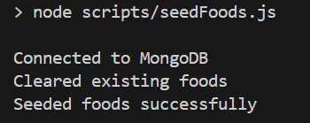
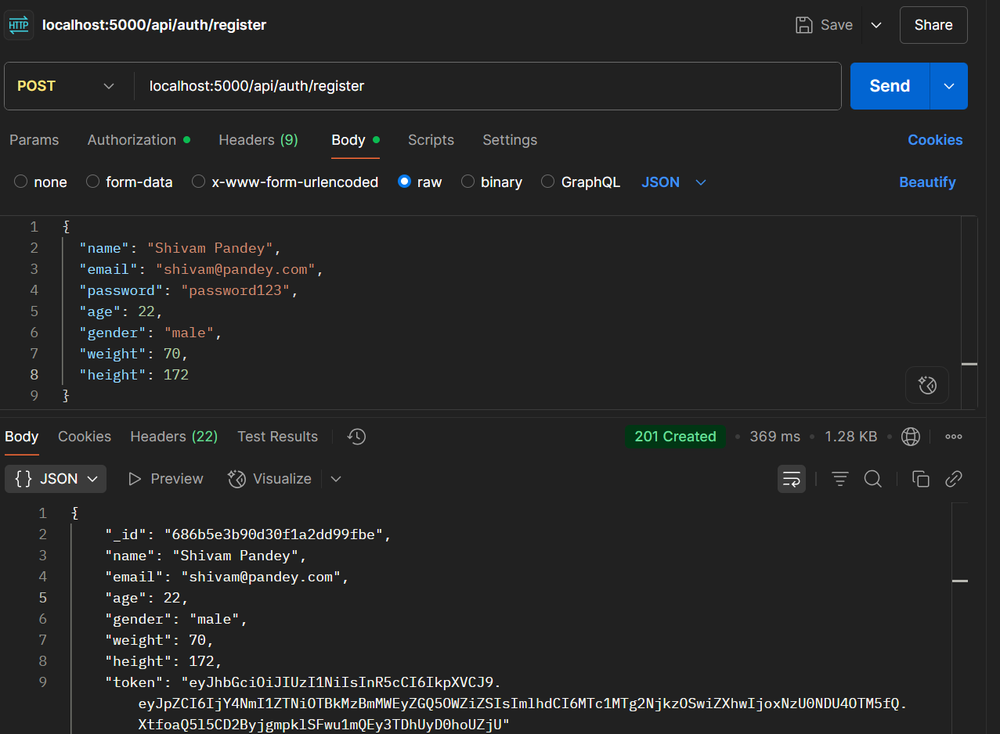
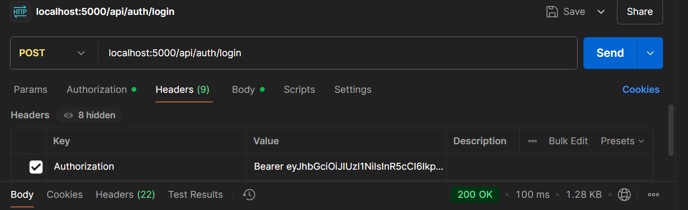
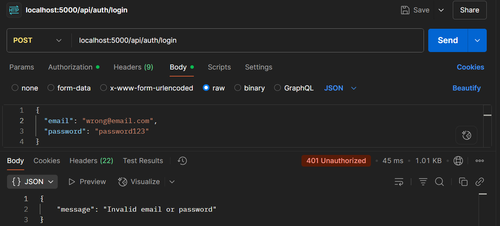
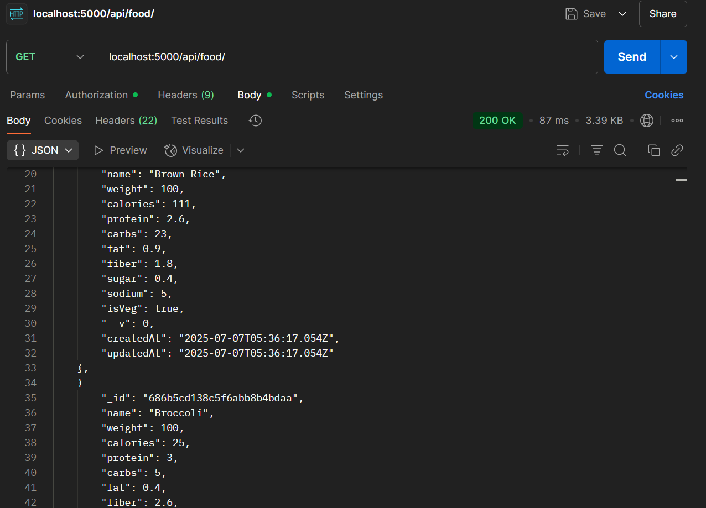
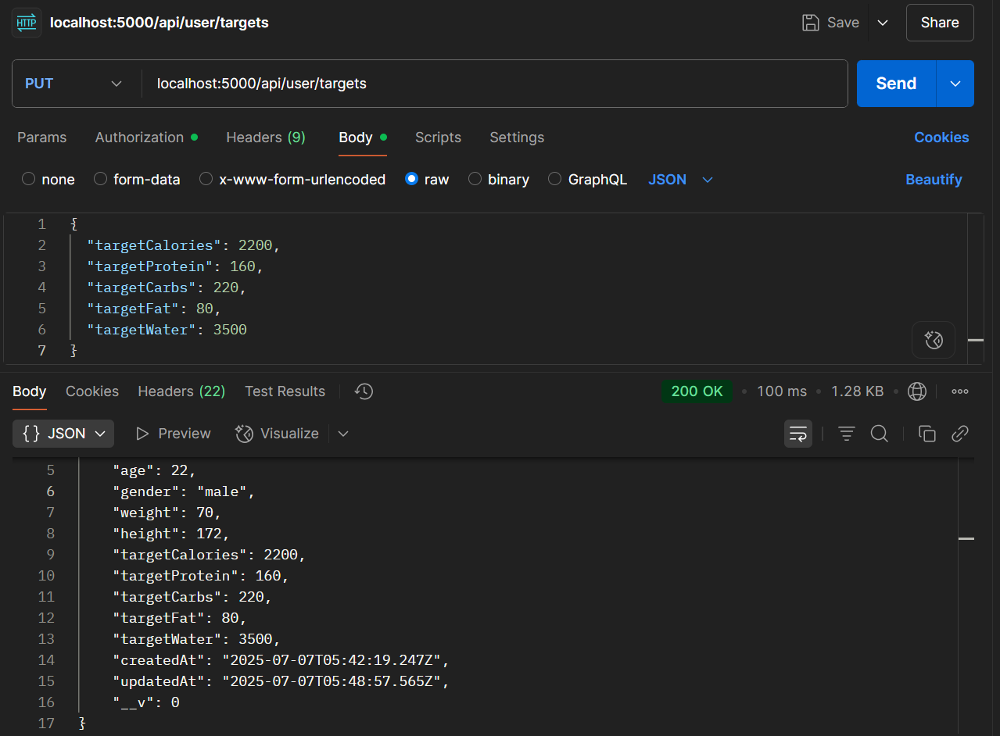
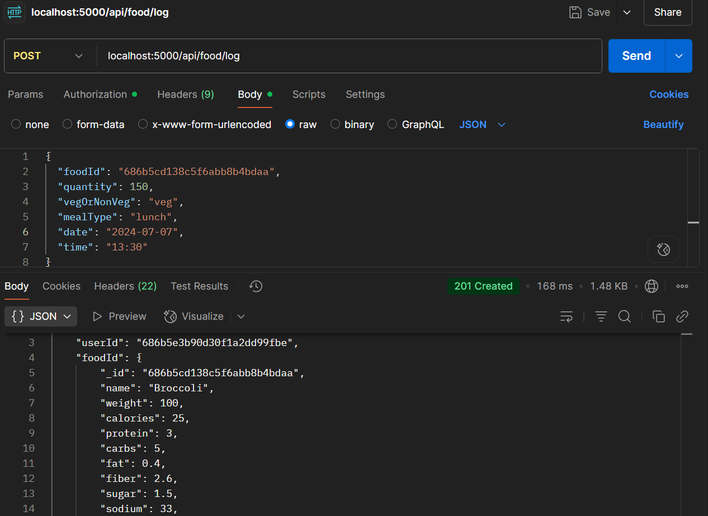
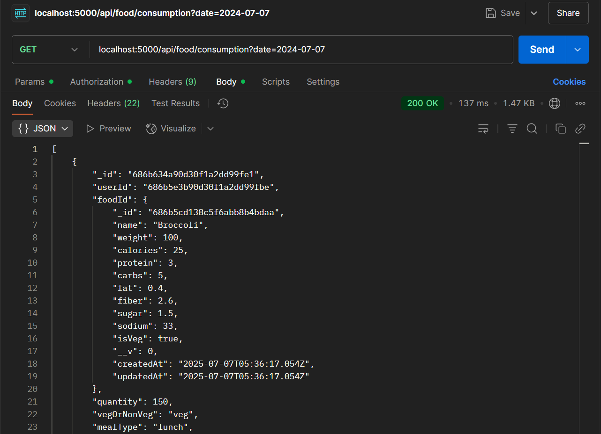
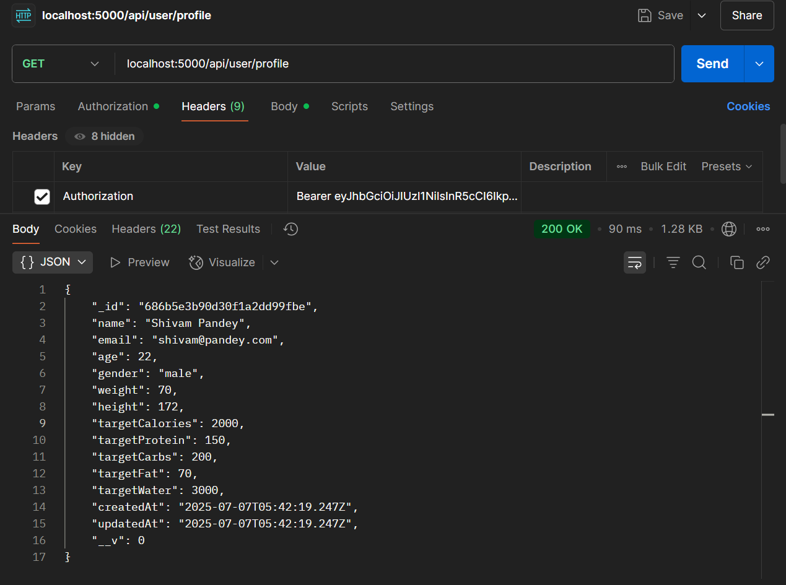
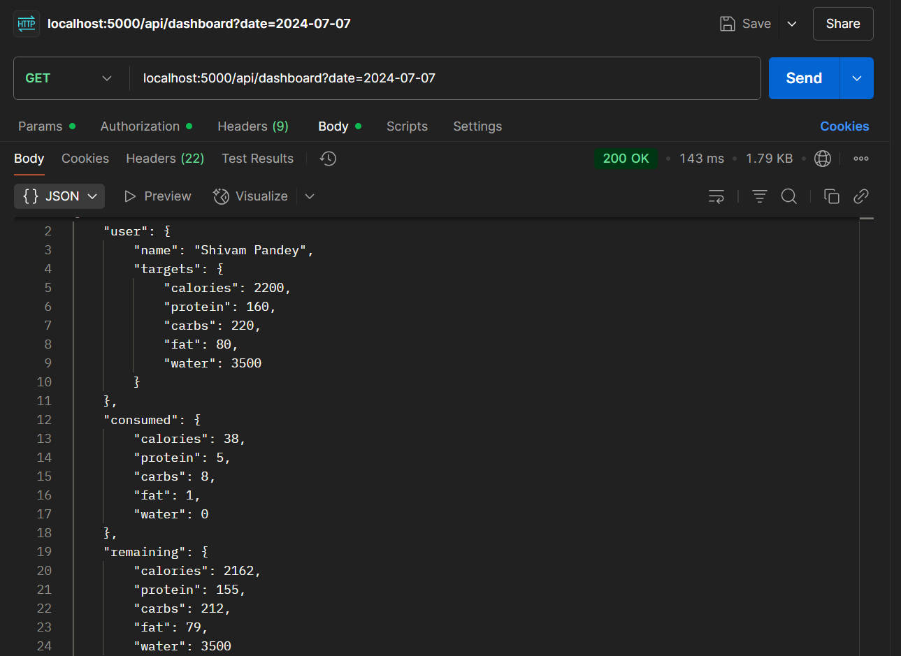

# Macro Tracker Backend API

A comprehensive backend API for tracking macronutrients, water intake, and weight management built with Node.js, Express, MongoDB, and JWT authentication.

## Features

- **User Authentication**: JWT-based registration and login
- **Profile Management**: Update user information and macro targets
- **Food Database**: Searchable food database with nutritional information
- **Food Logging**: Track food consumption with meal types and quantities
- **Water Tracking**: Log and monitor daily water intake
- **Weight Logging**: Track weight changes over time
- **Dashboard**: Daily nutrition overview with aggregated data
- **Security**: JWT and password hashing

## Application Flow

### Step 0: Seed database with initial food data
```bash
npm run seed
```



### 1. Register user


### 2. Login user



### 3. Get food items


### 4. Search for a particular food item


### 5. Set targets


### 6. Log diary entries


#### similarly we can log weight and water intake

### 7. See the logs


### 8. Get the profile


### 9. Check dashboard


## 🗂️ Project Structure

```
macro-tracker-backend/
├── config/
│   └── db.js                 # Database connection
├── controllers/
│   ├── authController.js     # Authentication logic
│   ├── userController.js     # User profile management
│   ├── foodController.js     # Food operations
│   ├── waterController.js    # Water tracking
│   ├── weightController.js   # Weight logging
│   └── dashboardController.js # Dashboard aggregation
├── middleware/
│   └── auth.js              # JWT authentication middleware
├── models/
│   ├── User.js              # User schema
│   ├── Food.js              # Food schema
│   ├── FoodConsumption.js   # Food consumption schema
│   ├── WaterConsumption.js  # Water consumption schema
│   └── WeightLog.js         # Weight log schema
├── routes/
│   ├── auth.js              # Authentication routes
│   ├── user.js              # User routes
│   ├── food.js              # Food routes
│   ├── water.js             # Water routes
│   ├── weight.js            # Weight routes
│   └── dashboard.js         # Dashboard routes
├── scripts/
│   └── seedFoods.js         # Database seeding script
├── utils/
│   └── generateToken.js     # JWT token generation
├── .env                     # Environment variables
├── server.js                # Main server file
└── package.json             # Dependencies and scripts
```